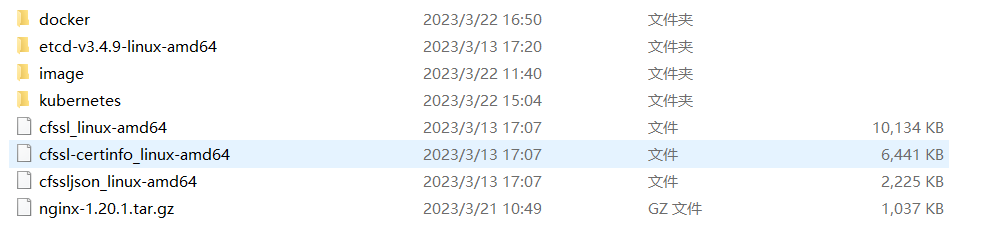

# ansible-deploy-kubernetes

# 设计思想

- 简单：用户只需要根据场景设置hosts.yaml，其余的事情交给playbook.yaml
- 灵活：hosts.yaml中以"机器IP"为单位，方便使用者针对每台机器不同的配置进行灵活使用
- 靠谱：在适当位置输出服务信息，对部署完毕的任务进行存活检查，保证服务正常可用

# 支持功能

| 功能                | 系统版本           | k8s版本 |
| ------------------- |----------------|-------|
| 单master多node      | Ubuntu/Centos7 | v1.20.0/v1.21.14/ |
| 双master多node      | Ubuntu/Centos7 |    v1.20.0   |
| 检查k8s集群配置参数 | Ubuntu/Centos7 |   v1.20.0    |
| 网络插件选择flannel/calico | Ubuntu/Centos7 | v1.20.0 |
| dashboard自动部署 | Ubuntu/Centos7 | v1.20.0 |
| metrics server自动部署 | Ubuntu/Centos7 | v1.20.0 |
| coredns自动化部署 | Ubuntu/Centos7 | v1.20.0 |
| 容器选择docker/containerd |  |  |
| 自定义安装路径和证书路径 |  |  |
| 支持重复执行（当某个服务因为网络缓慢而导致失败时，重复执行即可） |  |  |

默认软件版本：

- kubernetes:v1.20.0
- docker:23.0.1
- etcd:v3.4.9
- nginx:1.20.1


默认安装kubernetes版本为v1.20.0，如果需要更改版本请将package/kubernetes内容更换为需要的版本,
[官方二进制包下载地址](https://github.com/kubernetes/kubernetes/tree/master/CHANGELOG) 
etcd、nginx、docker版本更换同kubernetes一样

# 前提条件

部署k8s的机器有网络（ntpdate ntp.aliyun.com;  docker pull image等操作依赖网络环境）

部署k8s的机器与ansible机器已经分发sshkey(如果是大量裸机部署，请使用脚本进行批量分发)


# 如何使用

为方便大家使用，将需要可能根据具体环境调整的参数都放到了hosts.yaml中，该文件将作为“input”。

使用时需要将已下文件进行补充，都是部署kubernetes中用到的二进制文件包

百度网盘 链接：https://pan.baidu.com/s/1RyDqIoDGC6CvvNB0_RB-WQ 
提取码：7788 



如果需要更换docker\kubernetes\etcd的版本，请将下载后的二进制文件解压后放到package中即可

```yaml
all:
  vars: # 全局变量
    registry_mirrors: https://b9pmyelo.mirror.aliyuncs.com #docker daemon.json的阿里云加速地址
    service_cluster_ip_range: 10.0.0.0/24 #k8s集群service cluster ip地址范围
    kubelet_bootstrap_token: c47ffb939f5ca36231d9e3121a252940 # kubelet bootstrap token
    cluster_cidr: 10.244.0.0/16 # pod 网段
    kube_apiserver_port: 6443 # kube apiserver 端口
    clusterDNS: 10.0.10.2 # 集群dns地址
    virtual_port: 16443 # VIP端口（注意不要和kube_apiserver_port冲突）
    virtual_ipaddress: 10.0.0.100/24  # VIP地址
  children:
    master: # master组，增加master节点可以直接增加IP地址
      hosts:
        10.0.0.6: # master节点1
          vars: # 该机器的变量
            host_name: k8s_master01 #主机名
            etcd_name: etcd-1 # 安装etcd并设置为etcd-name为etcd-1
            etcd_peer_port: 2380 # etcd peer端口
            etcd_client_port: 2379 # etcd client 端口
            etcd_tls: true # 用于生成etcd证书
            k8s_tls: true # 用于生成k8s证书
            interface: eth0 #该机器的网卡名 （单机版请取消该变量）
            priority: 100 # keepalived优先级 （单机版请取消该变量）
            vrrp_instance_state: MASTER # vrrp instance是master还是backup （单机版请取消该变量）
        10.0.0.9:  # master节点2
          vars:
            host_name: k8s_master02 #主机名
            interface: eth0 #该机器的网卡名 
            priority: 90 # keepalived优先级
            vrrp_instance_state: BACKUP # vrrp instance是master还是backup
    node: # node组
      hosts: 
        10.0.0.7: # node节点01
          vars: # 该机器的变量
            host_name: k8s_node01 # 主机名
            etcd_name: etcd-2 # 安装etcd并设置为etcd-name为etcd-2
            etcd_peer_port: 2380 # etcd peer端口
            etcd_client_port: 2379 # etcd client 端口
        10.0.0.8: # node节点02
          vars: # 该机器的变量
            host_name: k8s_node02 # 主机名
            etcd_name: etcd-3 # 安装etcd并设置为etcd-name为etcd-3
            etcd_peer_port: 2380 # etcd peer端口
            etcd_client_port: 2379 # etcd client 端口
```

安装过程截图


# 扩展node
注意： 使用该剧本安装的k8s集群才能够使用一键扩展node，因为涉及到master节点的证书。
```shell
ansible-playbook -i hosts.yaml  playbook.yaml  --limit 10.0.0.11


[root@k8s_master01 ~]# kubectl get csr
NAME                                                   AGE   SIGNERNAME                                    REQUESTOR           CONDITION
node-csr-6XEuqU53QHz2j37zX4GOEjqYTfSimVzJgif12CkCe8s   50s   kubernetes.io/kube-apiserver-client-kubelet   kubelet-bootstrap   Pending
node-csr-FFGP0v_xlWI5BKTYdzNfM8GQgiWfXFQjVbvy7zaVbrI   9h    kubernetes.io/kube-apiserver-client-kubelet   kubelet-bootstrap   Approved,Issued
node-csr-MpurzqSfaOQ6jNFvYtpEGNjQlZC0_SpWt_KG2W8VymQ   9h    kubernetes.io/kube-apiserver-client-kubelet   kubelet-bootstrap   Approved,Issued
node-csr-RU29eWAfemtGjoC1q1KTBnnhYK7k-fI5IPl6ec8IGZw   9h    kubernetes.io/kube-apiserver-client-kubelet   kubelet-bootstrap   Approved,Issued
node-csr-djrH1OUBQm2o50HtbYd0SX43O61ak0g6LbiEfbFf6WA   9h    kubernetes.io/kube-apiserver-client-kubelet   kubelet-bootstrap   Approved,Issued

kubectl certificate approve  node-csr-6XEuqU53QHz2j37zX4GOEjqYTfSimVzJgif12CkCe8s

[root@k8s_master01 ~]# kubectl  get nodes
NAME        STATUS   ROLES    AGE    VERSION
10.0.0.11   Ready    <none>   118s   v1.20.0
10.0.0.6    Ready    <none>   9h     v1.20.0
10.0.0.7    Ready    <none>   9h     v1.20.0
10.0.0.8    Ready    <none>   9h     v1.20.0
10.0.0.9    Ready    <none>   9h     v1.20.0

```


